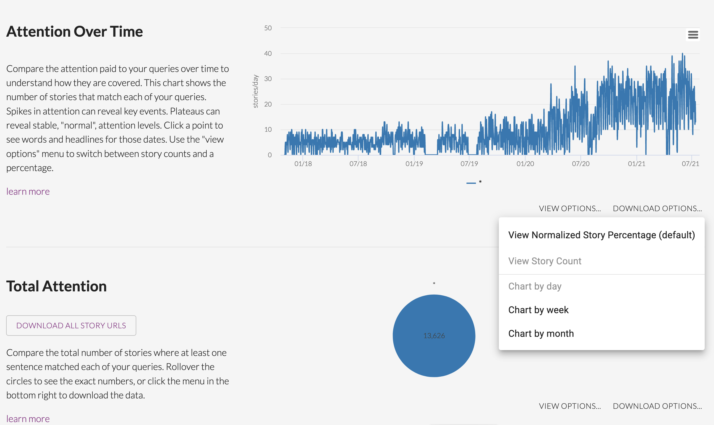

# Extraction of data from Media Cloud {#c21_mediacloud}

```{r}
library(quanteda)
library(dplyr)
library(ggplot2)
library(tidytext)
library(knitr)

knitr::opts_chunk$set(cache = TRUE,
                      echo = TRUE,
                      comment = "")


```


(tbd : presentation of the MediaCloud project)

Mediacloud can be freely used by researchers. All you have to do is to create an account at the following adress :

https://explorer.mediacloud.org


## How to extract data from mediacloud ?

You have different ways to get title of news. We will focus here on a simple example of data obtained through the mediacloud interface. We suppose that you want to extract news from the Tunisian newspapers speaking from Europe.


### Selection of media with source manager

We use the application called *Source Manager* and we introduce a research by collection which is the most convenient to explore what is available in a country. In our example, the target country is Tunisia and we have three collections that are propsed : 

```{r, echo=FALSE}
knitr::include_graphics("pics/mc_source_001.png")
```

We have selected the collection named "Tunisia National" because we are interested in the most important newspapers of the country. 

```{r, echo=FALSE}

```
The buble graphic on the right indicates immediately the media that has produced the highest number of news, but it is wise to explore in more details the list on the left which indicates for each media the statting date of data collection. 

When a media appears interesting, we click on its name to obtain a brief summary of the metadata. For example, in the case of *L'économiste Maghrebin* the metadata indicates :

```{r, echo=FALSE}
knitr::include_graphics("pics/mc_source_003.png")
```

The media looks promising,  but before to go further, it can be better to have a look at the website of the media to have a more concrete idea of the content if we don't know in advance what it is about in terms of content, what is the ideological orientation, etc. 


```{r, echo=FALSE}
knitr::include_graphics("pics/ecomag.png")
```

Here we can see that this is an ecnomic journal, published in french, with news organized in concentric geographic circles (Nation > Maghreb > Africa > World) which is precisely what we are looking for in the IMAGEUN project. We will further complete the informations about this, but before to do that we have to check in more details if the production of the media is regular through time with another tool offered by mediacloud, the explorer.

### Checking the stability through time

We have clicked on *search in explorer* on the metadata page of the Source Manager and obtain a news interfacce where we modify the date to cover the full period of collection of the media (or our period of interest). In the research field, we let the search term `*` which indicates a research on all news.

```{r, echo=FALSE}

```


Below your request, you obtain a graphic entitled *Attention Over Time* with the distribution of the number of news published per day which help you to verify if the distribution of news is regular through time. You just have to modify the type of graphic in order to visualize *Story Count* and you can choose the time span you want (day, week or month) for the evaluation of the regularity of news flow. In our example, we notice that at daily level they are some brief period of break in 2019, but the flow is reasonnabely regular with approximatively 5 news per day at the beginning and 10 to 20 in the final period. We also notice a classical week cycle with a decrease of news published during the week-end. 

```{r, echo=FALSE}

```

Going down, you will find a news panel entitled *Total Attention* which gives you the total number of stories found. In our example, we have a total of 13626 stories produced by our media over the period.


```{r, echo=FALSE}
knitr::include_graphics("pics/mc003.png")
```

### Selection of news specifically related to a topic (option)

You can eventually use Mediacloud to check the number of news produced about a specific topic, for example Europe or European Union or EU. The request shouldbe put in lower case with "" for compounds. Detailed explanation are available in the .

```{r, echo=FALSE}
knitr::include_graphics("pics/mc_explo_003.png")
```
This time you can use the graphic option *Stories percentage* rather than *Story count* if you want to viusalize the salience of the topic through time.

```{r, echo=FALSE}
knitr::include_graphics("pics/mc_explo_004.png")
```

In our example, we have 369 news that appears to be related to our request about Europe or EU with a relatively regular pattern at month level of 1 to 3 \% of news and exceptionaly 5 to 7 \%.

### Download and storage of news

According to your selection (all news or a specific topic) you will download more or less title. Here, me make the choice to get all news, which means that we have to repeat the original request with `*`.

Finally, by clicking on the button *Download all story URLS*, you can get a .csv file that you can easily load in your favorite programming language. 

## How to import and export mediacloud data to R

In the case of R, you can easily use the simple program below to import a csv file extracted from mediacloud  at the data and transform the result firstly in a classical `data.frame`object. 

```{r loadcsv, echo=TRUE}
df<-read.csv(file =("data/corpora/TUN/-all-story-urls-20210713153555.csv"),
             sep=",",
             header=T,
             encoding = "UTF-8",
             stringsAsFactors = F)
head(df)
str(df)
```
 

### Transformation in quanteda format.

Currently, the size of the file (unzipped) is equal to 4 Mb. But we can observe that a lot of information are the same for all news and should not necessarily be kept. We can  We propose therefore another form of storage based on `quanteda` format.

```{r create quanteda, echo=T}
# Create Quanteda corpus
qd<-corpus(df$title)

## Add id
qd$id<-df$stories_id

## Add source code
qd$source<-"ecomag"

# Add date
qd$date<-df$publish_date

# add language
qd$lang<-"fr"

# add_url
qd$url<-df$url


# Add global meta
meta(qd,"meta_source")<-"Media Cloud "
meta(qd,"meta_time")<-"Download the 2021-07-13"
meta(qd,"meta_author")<-"Elaborated by Claude Grasland"
meta(qd,"project")<-"ANR-DFG Project IMAGEUN"
str(qd)
```


We have created a quanteda object with a lot of information stored in various fields. The structure of the object is the following one

```{r, echo=TRUE}
str(qd)
```

We can look at the first titles with *head()*

```{r, echo=TRUE}
kable(head(qd,3))
```


We can get meta information on each stories with *summary()*

```{r, echo=TRUE}
summary(qd,3)
```

We can get meta information about the full document

```{r, echo=TRUE}
meta(qd)
```


### Storage of the quanteda object

We can finally save the object in .Rdata format in a directory dedicated to our quanteda files. It can be usefull to give some information in the name of the file

```{r, echo=TRUE}
saveRDS(qd,"data/corpora/TUN/qd_ecomag_titles.Rdata")
```

We have kept all the information present in the initial file, but also added specific metadata of interest for us. The size of the storage is now equal to 0.43Mb which means a division by 8 as compared to the initial .csv file downloaded from Media Cloud.

### Backtransformation of quanteda to data.table or tibble

In the following steps, we will make an intensive use of quanteda, but sometimes it can be usefull to export the results in a more practical format or to use other packages. For this reasons, it is important to know that the `tidytext`package can easily transform quanteda object in tibbles which are more classical and easy to manage 

```{r}
td <- tidy(qd)
head(td)
str(td)
```


