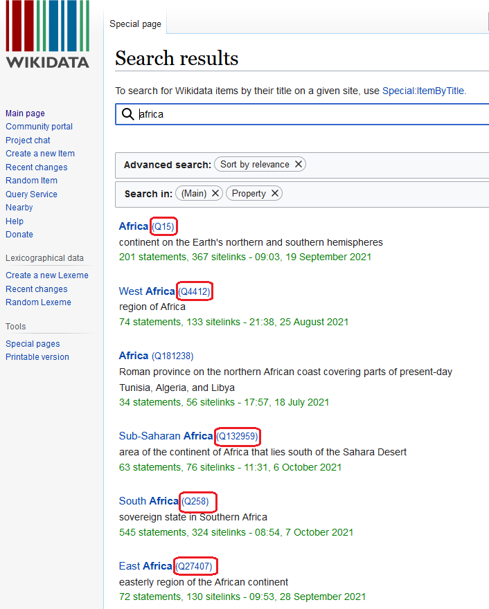

# Wikidata {#c23_wikidata}

```{r}
library(knitr)
```


 **Authors** : Claude Grasland & Etienne Toureille

## Introduction

The objective of this short note is to explore the possibility of Wikidata  for the production of multilingual dictionaries of world regions and more generally regional imaginations. In order to test the interest of this approach, we will try to produce multilingual dictionaries for the identification of five groups of entities :

- Europe and its subregions 
- Africa and its subregions
- Asia and its subregions
- Mediterranea 
- Middle East, Near East, Persian Gulf ...


The dictionary will be established in five languages of interest for the project IMAGEUN :

- english : applied to media of UK and Ireland
- french : applied to media of France and Tunisia
- german : applied to media of Germany
- turkish : applied to media of Turkey
- arabic : applied to media of Tunisia


## Wikidata 

[Wikidata](https://www.wikidata.org/wiki/Wikidata:Main_Page) defines itself as

- a free and open knowledge base that can be read and edited by both humans and machines.
-  as central storage for the structured data of its Wikimedia sister projects including Wikipedia, Wikivoyage, Wiktionary, Wikisource, and others.
- a support to many other sites and services beyond just Wikimedia projects! The content of Wikidata is available under a free license, exported using standard formats, and can be interlinked to other open data sets on the linked data web.

### Codification of entities

The first interest of wikidata is to provide unique code of identifications of objects. For example a research about "Africa" will produce a list of different objects characterized by a unique code : 

```{r}

```

### Informations on entities

Once we have selected an entity (e.g. **Q15**) we obtain a new page with more detailed informations in english but also in all other languages available in Wikipedia. 

```{r}
knitr::include_graphics("pics/Wikidata002.png")
```

A lot of information are available concerning the entity but, at this stage, the most important ones for our research are :

1. the **translation** in different languages
2. the **equivalent** words or expression in different languages
3. the **definitions** in different languages
4. the **ambiguity** of the term in each language and the potential risks of confusion with other entities.

Of course we should not take for granted the answers proposed by wikidata (as noticed by Georg, Wikipedia is a matter of research for IMAGEUN ...) but without any doubt, it offers a very good opportunity to clarify our questions and help us to build tools for recognition of world regions and other geographical imaginations in a multilingual perspective. 

### Wikipedia entities as nodes of an ontolongy

It appears crucial to introduce here a clear distinction between **Wikipedia entities** and **textual units** associated to the names and definiton of this units. 

A **wikipedia entity** like *Q15* is an **element of an ontology** designed by its author for specific purposes. The specificity of the wikidata ontology is the fact that it is a **multilinligual web** where Q15 is a **node of the web** present in different linguistic layers. It means that we don't have a single name or a  single definition of Q15, except if we adopt the neocolonial perspective to choose the english language as reference. Depending on the context (i.e. the language or sub-language), Q15 could be defined as :

- (fr) : A *"continent"* named *"Afrique"*" 
- (en) : A *"continent on the Earth's northern and southern hemispheres"* named *"Africa"* or *"African continent"* 
- (de) : A *"Kontinent auf der Nord- und Südhalbkugel der Erde"* named *"Afrika"*
- (tr) : A *"Dünya'nın kuzey ve güney yarıkürelerindeki bir kıta"* named *"Afrika"* or *"Afrika kıtası"*
- (ar) : The *" ثاني أكبر قارات العالم من حيث المساحة وعدد السكان، تأتي في المرتبة الثانية بعد آسيا"* ^[second largest continent in the world in terms of area and population, comes second only to Asia.]  named *"إفريقيا"* or *"القارة الأفريقية"*  

In other words the **existence of the same code of wikipedia entities does not offer any guarantee of concordance between the geographical objects found in news published in different languages or different countries**. But - and it is the important point - it help us to point similarities and differences between set of geographical entities that are more or less comparable in each language. 


### A tool for cross-linguistical experiments

Having in mind the limits of the equivalence of entities across languages, it can nevertheless be an interesting experience to select a set of wikipedia entities (Q15, Q258, Q4412 ...) and to examine their relative frequency in our different media from different countries with different languages. A typical hypothesis could be something like :

- Is *Q15* more mentionned than *Q46* in Tunisian newspapers ?

which is **not equivalent** to the question 

- Is Africa more mentionned than Europe in Tunisian newspapers

but rather equivalent to the two joint questions

- Is the textual unit "*Afrique*" more mentionned than the textual unit "*Europe*" in Tunisian newspapers published **in french language**.
- Is the textual unit *"إفريقيا"* more mentionned than the textual unit "*أوروبا*" in Tunisian newspapers published **in arabic language**.


## The package WikidataR

The package [WikidataR](https://cran.r-project.org/web/packages/WikidataR/WikidataR.pdf) is an interface for the use of the Wikidata API in R language. Equivalent tools are available in Python and other languages for those non familiar with R. And it is of course possible to use directly the API. The first step is to install the most recent version of the R package `WikidataR` which install also related packages of interest.

```{r}
#install.packages("WikidataR")
library(WikidataR)
```


### Basic operations

(based on Etienne Toureille previous experiments)

#### find_item

This function help to find all wikipedia entities (=items) associated to a textual unit (word or group of word) in  given language. Let's start with the research of entities associated to "Afrique" in french language : 

```{r}
mytext <- "Afrique"

items <- find_item(search_term = mytext,
                   language = "fr",
                   limit=30)
class(items)
length(items)

```
The resulting object is an object from type `find_item` which is in practice a `list` describing the entities that has been recognized associated to the textual unit that we have chosen. In the french cas, we have found 50 entities that match with our textual unit. Let's have a look at the first one :

```{r}
items[[1]]
```

As we can see we can easily identify the code the label and description in english but also the text responsible from the matching answer in french. We can therefore create a function `item_info` that extract all elements of interest and put them in a table in order to have a complete view.


```{r}
item_info <- function(my_item){ 
  
  item_id    <- my_item$id
  item_label <- my_item$label
  item_desc <- NA
  if ("description" %in% names(my_item)) {item_desc<-my_item$description}
  item_lang  <- my_item$match$language 
  item_text  <- my_item$match$text
  
  res<-data.frame(item_id,item_label,item_desc,item_lang,item_text)
  return(res) 
  }


```

For example : 

```{r}
item_info(items[[4]])
```


We build then a second function that extract all the wikipedia entities associated to a textual unit for a given language


```{r}
extract_entities <- function(mytext= "Afrique",
                             mylang = "fr",
                             maxres = 20) {
  # Extract items
  items <- find_item(search_term =  mytext,
                   language      =  mylang,
                   limit         =  maxres)
  
  # Create empty dataset
  res<-data.frame()
  res$item_id    <- as.character()
  res$item_label <- as.character()
  res$item_desc <- as.character()
  res$item_lang  <- as.character()
  res$item_text  <- as.character()
  
  # Fill dataset
  k<-length(items)
      for (i in 1:k) {
           res <- rbind(res,item_info(items[[i]]))
      }
  
  # Return dataset
  return(res)

}

  
```

For example :

```{r}
tab <- extract_entities("Afrique","fr",100)
kable(tab)
```
As we can see, many of the entities proposed in he list are not interesting and we will probably have to select one by one the entities of interest. But we have clearly to keep two different list of entities :

- **the target entities** : that we consider as potential world regions or candidate to te title of "geographic imagination". 
- **the control entites** : that we have to identify or eliminate if we want to identify correctly our target entities like the country of South Africa


In the case of Africa, we could for example establish a more limited list

```{r}
target <- c("Q15", "Q4412","Q132959", "Q27394","Q27407","Q27381","Q27433")
control <- c("Q258")

tab<-tab %>% filter(item_id %in% c(target,control))
kable(tab)
```

But this list which was based on the french textual units associated to "Afrique" should certainly be completed by equivalent list established for other languages with different seeds ("Africa" in english, "Afrika" in german, ...)


